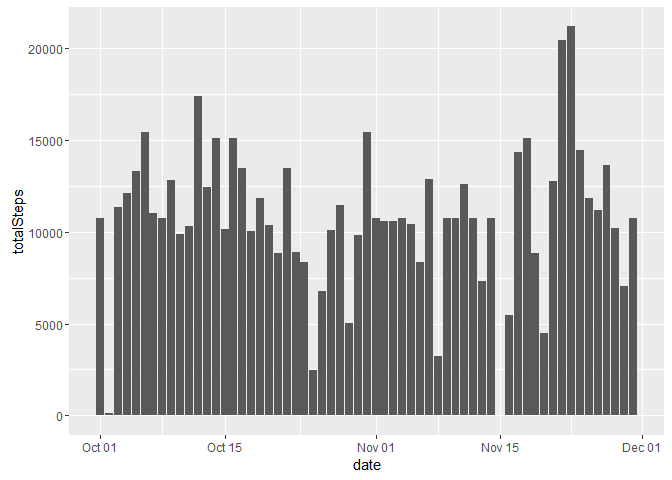

# Reproducible Research: Peer Assessment 1


## Loading and preprocessing the data

```r
library(dplyr)
```

```
## 
## Attaching package: 'dplyr'
```

```
## The following objects are masked from 'package:stats':
## 
##     filter, lag
```

```
## The following objects are masked from 'package:base':
## 
##     intersect, setdiff, setequal, union
```

```r
library(ggplot2)
library(lubridate)
```

```
## 
## Attaching package: 'lubridate'
```

```
## The following object is masked from 'package:base':
## 
##     date
```

```r
unzip("activity.zip")
rawData <- read.csv("activity.csv", stringsAsFactors = FALSE)
rawData$date <- as.POSIXct(rawData$date)
```


## What is mean total number of steps taken per day?

```r
# Calculates mean and median steps per day
stepsPerDate <- rawData %>% na.omit(rawData) %>% group_by(date) %>% summarise(totalSteps=sum(steps)) #%>%
summarisedStepsPerDate <- stepsPerDate %>%  summarise(meanSteps=mean(totalSteps), medianSteps=median(totalSteps))
# Produces plot of total number of steps per day
g <- ggplot(stepsPerDate,aes(date,totalSteps)) +
  geom_bar(stat="identity")
print(g)
```

<!-- -->

```r
# Prints mean and median steps per day
summarisedStepsPerDate
```

```
## # A tibble: 1 × 2
##   meanSteps medianSteps
##       <dbl>       <int>
## 1  10766.19       10765
```


## What is the average daily activity pattern?

```r
# Calculates mean steps per interval
# Note --> na.omit is used so that the means are numbers and not NA
stepsPerInterval <- rawData %>% na.omit() %>% group_by(interval) %>%
  summarise(meanSteps=mean(steps))
# Produces plot of mean steps per interval
with(stepsPerInterval, plot(interval,meanSteps,type="l",main="Mean steps per interval over the course of all days"))
```

<!-- -->

```r
# Finds and returns the maximum mean steps per interval
stepsPerInterval[which(stepsPerInterval$meanSteps==max(stepsPerInterval$meanSteps)),]
```

```
## # A tibble: 1 × 2
##   interval meanSteps
##      <int>     <dbl>
## 1      835  206.1698
```


## Imputing missing values

```r
# Calculates numer of missing values (rows with NAs)
sum(!complete.cases(rawData))
```

```
## [1] 2304
```

```r
# Fills in the NA values using the mean from that interval
# And stores the results into completeData
naData <- rawData[!complete.cases(rawData),]
naData <- left_join(naData, stepsPerInterval, by="interval")
naData$steps <- naData$meanSteps
naData <- subset(naData, select=-c(meanSteps))
completeData <- left_join(rawData, naData, by=c("date","interval"))
completeData[is.na(completeData$steps.x),][["steps.x"]] <- completeData[is.na(completeData$steps.x),][["steps.y"]]
completeData <- subset(completeData, select=-steps.y)
colnames(completeData)[which(names(completeData)=="steps.x")] <- "steps"

completeStepsPerDate <- completeData %>% group_by(date) %>% summarise(totalSteps=sum(steps)) #%>%
summarisedCompleteStepsPerDate <- completeStepsPerDate %>%  summarise(meanSteps=mean(totalSteps), medianSteps=median(totalSteps))
# Produces plot of total number of steps per day
g <- ggplot(completeStepsPerDate,aes(date,totalSteps)) +
  geom_bar(stat="identity")
print(g)
```

<!-- -->

```r
# Prints mean and median steps per day
summarisedCompleteStepsPerDate
```

```
## # A tibble: 1 × 2
##   meanSteps medianSteps
##       <dbl>       <dbl>
## 1  10766.19    10766.19
```


## Are there differences in activity patterns between weekdays and weekends?

```r
# Creates a factor variable indicating if that day is a weekday or weekend
completeDataWithDay <- completeData %>% mutate(weekdayOrWeekend=ifelse(wday(date)%in%2:6,"weekday","weekend"))
completeDataWithDay$weekdayOrWeekend <- as.factor(completeDataWithDay$weekdayOrWeekend)
# Finds the mean steps per interval for weekdays and weekends
stepsPerIntervalDataWithDat <- completeDataWithDay %>% group_by(weekdayOrWeekend,interval) %>%
  summarise(meanSteps=mean(steps)) 
# Produces a plot comparing mean steps per interval for weedays and weekends
g <- ggplot(data=stepsPerIntervalDataWithDat, aes(interval, meanSteps)) +
  facet_grid(weekdayOrWeekend~.) +
  geom_line()
print(g)
```

<!-- -->
